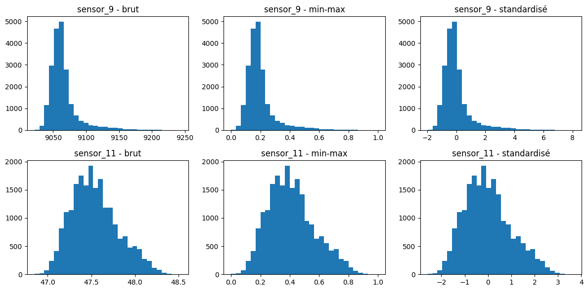
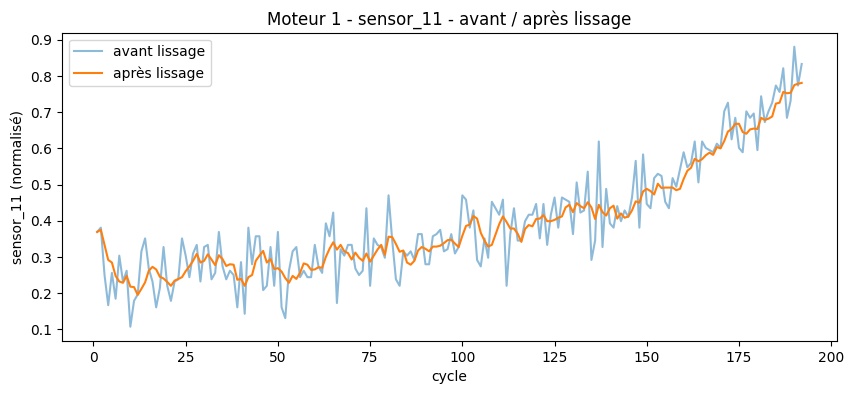

# Phase 1 — EDA et préparation des données (FD001)

**Statut** : validée.

## Contexte

Avant toute modélisation, les données brutes de `train_FD001.txt` (100 moteurs, 20 631 lignes, 26 colonnes) doivent être nettoyées et mises en forme, selon trois étapes définies dans le cahier des charges (section Phase 1) : suppression des capteurs non informatifs, normalisation par capteur, lissage du signal. Notebook complet : [`notebooks/01_eda_preparation.ipynb`](../notebooks/01_eda_preparation.ipynb).

## Méthode et résultats

### 1. Suppression des capteurs à variance nulle

Sur les 21 capteurs, certains ne varient jamais, quel que soit le moteur ou le cycle — ils ne peuvent apporter aucune information sur la dégradation. Un premier critère naïf (`variance == 0`) s'est révélé insuffisant : `sensor_5` et `sensor_16` sont réellement constants, mais leur variance calculée tombe à ≈1e-29 / 1e-35 à cause d'une erreur d'arrondi flottant, pas exactement 0. Critère retenu : `nunique() == 1` (nombre de valeurs distinctes), fiable indépendamment de la précision numérique.

**Résultat** : 6 capteurs constants retirés (`sensor_1, 5, 10, 16, 18, 19`) — 15 capteurs informatifs conservés sur 21.

### 2. Normalisation

Les 15 capteurs restants ont des échelles très différentes (`sensor_1` ≈ 518, `sensor_16` ≈ 0.03, `sensor_9` dans les milliers), ce qui peut fausser artificiellement l'importance relative des capteurs pour un modèle. Deux méthodes ont été comparées empiriquement sur les vraies données plutôt que choisies par convention seule :

- **Min-max** : `(valeur - min) / (max - min)`, ramène chaque capteur entre 0 et 1.
- **Standardisation (`StandardScaler`)** : `(valeur - moyenne) / écart-type`, centre chaque capteur sur 0 avec un écart-type de 1.

Les deux sont des transformations linéaires : elles ne changent jamais la forme d'une distribution, seulement l'échelle de l'axe. Comparer des histogrammes ne peut donc jamais montrer une différence de forme entre les deux — seulement une différence d'échelle et de compression relative :

`sensor_11` (distribution symétrique) ne pose de problème avec aucune des deux méthodes. `sensor_9`, en revanche, a une distribution fortement asymétrique : sous standardisation, son maximum atteint **+8.12 écarts-types** de la moyenne (`sensor_14` : +7.86, `sensor_8` : +6.53) — des valeurs extrêmes réelles. Sous min-max, cette même traîne fait que l'essentiel des valeurs "normales" de `sensor_9` tient entre 0 et environ 0.3, le reste de [0, 1] étant quasiment vide.

**Décision : min-max retenu.** Aucune des deux méthodes ne corrige la traîne de `sensor_9` (l'une la représente fidèlement en z-score, l'autre la comprime dans un coin de l'échelle) — l'argument "la standardisation gère mieux les outliers" ne suffit donc pas à trancher seul. Trois raisons ont fait pencher pour min-max :

1. La normalisation ne change rien pour les premiers modèles prévus en Phase 3 (Random Forest, XGBoost, LightGBM — insensibles à l'échelle des features). Elle compte pour le LSTM/CNN1D prévu ensuite. Faite une fois ici, elle donne un seul pipeline de données réutilisé par tous les modèles, plutôt que deux versions parallèles source d'incohérences.
2. Le LSTM (la cible réelle de ce choix) utilise des portes internes de type sigmoid/tanh, qui saturent pour de grandes valeurs — une entrée bornée [0, 1] est plus sûre qu'un z-score pouvant atteindre 8.
3. L'hypothèse implicite de la standardisation (distribution à peu près gaussienne) est elle-même mise à mal par nos données (`sensor_9` clairement asymétrique) ; le min-max ne suppose aucune forme de distribution, seulement un min/max physique plausible — raisonnable pour des mesures de capteurs bornées physiquement. Convention par ailleurs déjà établie dans la littérature C-MAPSS (Heimes 2008, dépôts communautaires étudiés).

**Coût accepté, à revalider** : ce choix n'est pas prouvé optimal, seulement argumenté. Si le LSTM performe mal en Phase 3-4, `sensor_9`, `sensor_14` et `sensor_8` sont les premiers suspects — le choix sera retesté à ce moment avec un vrai chiffre (RMSE / score NASA), pas une intuition.

### 3. Lissage du signal

Les capteurs contiennent du bruit de mesure cycle-à-cycle en plus du vrai signal de dégradation. Méthode retenue : **moyenne mobile, fenêtre de 5 cycles** (cohérente avec le benchmark exploratoire déjà documenté dans le README).

Deux règles de correction ont été respectées dans l'implémentation :

1. **Causalité** : le lissage du cycle `t` n'utilise que les cycles `≤ t` — `pandas.rolling()` est causal par défaut, jamais de cycle futur, condition nécessaire pour rester valide sur le jeu de test (où le futur d'un moteur en cours de vie n'est par définition pas connu).
2. **Par moteur, jamais à travers deux moteurs différents** : `train` empile les 100 moteurs les uns après les autres ; le lissage est appliqué séparément sur chaque moteur (masque sur `unit_number`) pour ne jamais mélanger la fin d'une trajectoire avec le début de la suivante.

La courbe lissée suit la même tendance de dégradation que la courbe brute, avec une gigue cycle-à-cycle nettement réduite.

## Trade-offs et limites

- Le choix min-max vs standardisation reste un jugement documenté, pas une certitude — revalidation prévue en Phase 4 (voir plus haut).
- La fenêtre de lissage (5 cycles) n'a pas été optimisée par recherche d'hyperparamètre à ce stade — reprise du choix du benchmark exploratoire pour rester comparable ; une optimisation plus fine est possible en Phase 3-4 si nécessaire.
- Ce travail couvre FD001 uniquement (1 régime opératoire). L'extension à FD002/FD004 (multi-régimes) nécessitera une normalisation conditionnelle par clustering K-Means sur les réglages opératoires (prévue au cahier des charges, non traitée ici).
