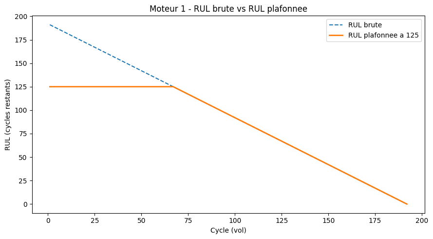
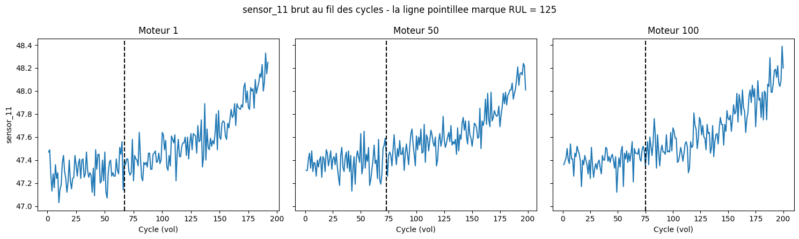

# Phase 2 — Target Engineering (RUL plafonnée à 125 cycles, FD001)

**Statut** : validée.

## Contexte

Avant de pouvoir entraîner un modèle, il faut construire la cible qu'il devra apprendre à prédire. Le fichier `train_FD001.txt` ne donne que le numéro du cycle en cours pour chaque moteur — jamais directement la durée de vie utile restante (RUL). Cette phase construit cette cible, puis la plafonne à 125 cycles comme convenu dans le cahier des charges (section Phase 2). Notebook complet : [`notebooks/02_target_engineering.ipynb`](../notebooks/02_target_engineering.ipynb).

## Méthode et résultats

### 1. Calcul de la vraie RUL par cycle

Dans `train_FD001.txt`, chaque moteur est suivi **jusqu'à sa panne** : le dernier cycle enregistré pour un moteur correspond au moment de la panne. La RUL à un cycle donné se déduit donc directement :

`RUL = dernier_cycle_du_moteur − cycle_actuel`

**Résultat** : calculée moteur par moteur avec une boucle explicite. Vérifiée sur le moteur 1 (192 cycles au total) : la RUL vaut 191 au premier cycle et décroît de 1 par cycle jusqu'à **0 exactement au dernier cycle enregistré** — cohérent avec la définition.

### 2. Plafonnement à 125 cycles (Piecewise Linear RUL)

En tout début de vie, les capteurs varient à peine d'un cycle à l'autre — le signal ne montre presque aucun signe de dégradation. Demander à un modèle de distinguer une RUL de 300 d'une RUL de 280 à partir d'un signal quasi immobile est une tâche impossible : il n'y a simplement pas assez d'information dans les capteurs à ce stade pour le justifier. La solution retenue par la quasi-totalité des projets de la communauté (cahier des charges, section 3) : plafonner la RUL à 125 cycles. Tant que la RUL brute dépasse 125, elle est remplacée par 125 ; en dessous, elle reste inchangée.

Le graphique confirme le comportement attendu : un plateau parfaitement plat à 125 tant que la RUL brute est au-dessus, puis la courbe plafonnée colle exactement à la courbe brute dès qu'elle repasse sous 125, jusqu'à 0 à la panne — la forme "linéaire par morceaux" recherchée.

### 3. Vérification empirique de l'argument "signal plat en début de vie"

Plutôt que de reprendre cet argument tel quel de la littérature communautaire, il a été vérifié sur les données réelles du projet. Sur 3 moteurs (1, 50, 100 — pas un seul, pour éviter de tirer une conclusion d'un cas isolé), `sensor_11` (pression en sortie du compresseur HP, déjà étudié en Phase 1) a été comparé entre la phase "début de vie" (RUL brute > 125) et la phase "fin de vie" (RUL brute ≤ 125) :

| Moteur | Écart-type début de vie | Écart-type fin de vie | Dispersion ×(fin/début) | Écart de moyenne |
|---|---|---|---|---|
| 1 | 0,121 | 0,256 | 2,12× | +0,327 |
| 50 | 0,108 | 0,219 | 2,02× | +0,289 |
| 100 | 0,089 | 0,238 | 2,66× | +0,311 |

**Constat reproductible sur les 3 moteurs** : le capteur est nettement plus stable et resserré en début de vie, et devient 2 à 2,7 fois plus dispersé (avec une dérive de moyenne d'environ +0,3) une fois sous 125 cycles restants. Ce n'est pas un signal parfaitement plat suivi d'une falaise, mais une différence de stabilité mesurable et cohérente d'un moteur à l'autre — suffisante pour justifier qu'un modèle ne peut pas distinguer des RUL élevées avec précision à partir de ce signal.

## Trade-offs et limites

- Le plafond de 125 cycles est une convention reprise de la communauté (cahier des charges, section 3), pas ré-optimisée spécifiquement pour ce projet — à revoir en Phase 4 si les métriques finales le suggèrent.
- La preuve empirique du signal porte sur 3 moteurs sur 100 et un seul capteur (`sensor_11`) — un indice cohérent, pas une démonstration exhaustive sur l'ensemble du jeu de données.
- Ce travail couvre FD001 uniquement. Le tableau `train` enrichi (RUL, RUL_cappee) n'est pour l'instant sauvegardé nulle part de façon persistante — il faudra soit l'exporter, soit refaire ce calcul dans le notebook de la Phase 3.
