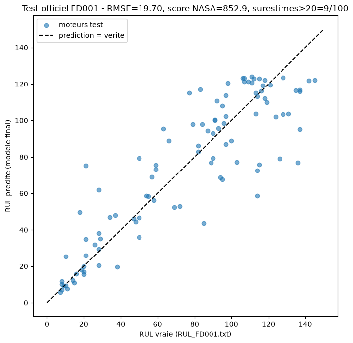

# Phase 3 — Modélisation baseline (XGBoost, FD001)

**Statut** : validée.

## Contexte

Avant cette phase, aucun chiffre de performance n'était reproductible dans le repo : l'ancien notebook
exploratoire produisant RMSE/score NASA a été supprimé ([ADR-0006](decisions/0006-suppression-baseline-exploratoire.md)).
Cette phase entraîne un premier modèle réel, en réutilisant les pipelines validés des Phases 1 et 2
(regroupés dans [`src/preprocessing.py`](../src/preprocessing.py)), et l'évalue sur le jeu de test officiel.
Notebook complet : [`notebooks/03_modelisation.ipynb`](../notebooks/03_modelisation.ipynb).

## Méthode et résultats

### 1. Features : fenêtre glissante et numéro de cycle

Pour chaque capteur, deux colonnes sont ajoutées : la moyenne et l'écart-type calculés sur les 5 derniers
cycles (moteur par moteur, causal). Elles capturent la tendance et la dispersion récentes du signal —
en particulier la hausse de dispersion en fin de vie déjà démontrée en Phase 2. Cela donne 45 features
(15 capteurs lissés + 15 moyennes glissantes + 15 écarts-types glissants).

À ces 45 colonnes s'ajoute `time_cycles` (le numéro du cycle en cours), soit **46 features** au total —
ajouté après le test d'ablation de la section 5. `unit_number` reste exclu : c'est une étiquette de moteur,
pas une mesure, et les moteurs du test sont d'autres moteurs que ceux du train. `time_cycles` n'est pas
normalisé (XGBoost est insensible à l'échelle ; il faudra le normaliser pour un LSTM ou un CNN 1D).

Au tout premier cycle de chaque moteur, l'écart-type glissant n'existe pas mathématiquement (une seule
valeur disponible) : les 1500 `NaN` résultants (100 moteurs × 15 capteurs) sont remplacés par 0.

### 2. Score NASA (Saxena et al., 2008)

Implémenté et vérifié par un cas de calcul simple avant utilisation : une surestimation de 20 cycles coûte
`exp(20/10)-1 ≈ 6.39`, une sous-estimation de 20 cycles coûte `exp(20/13)-1 ≈ 3.66` —
l'asymétrie voulue (surestimer, donc risquer une panne en vol, coûte plus cher) est confirmée dans le code.

### 3. Validation croisée par moteur (GroupKFold)

Un même moteur ne peut jamais apparaître à la fois dans le sous-ensemble d'entraînement et de validation
d'un pli : sinon le modèle risquerait de reconnaître partiellement ce moteur plutôt que d'apprendre un
patron général de dégradation, ce qui fausserait l'estimation de performance. Vérifié explicitement à
chaque pli (intersection vide entre les deux ensembles de moteurs).

`GroupKFold(n_splits=5, shuffle=True, random_state=42)` : par défaut, `GroupKFold` répartit les moteurs
entre les plis selon leur ordre d'apparition dans le fichier, pas au hasard — un choix qui pourrait
biaiser chaque pli si cet ordre correspondait à autre chose qu'un simple ordre de simulation. Vérifié
(à l'époque avec 45 features) : avec `shuffle=True`, le RMSE moyen ne change presque pas (18.61 sans
mélange vs 18.64 avec) — donc pas de biais caché ici — mais le mélange (avec une graine fixe pour rester
reproductible) est conservé pour ne plus jamais avoir à supposer que l'ordre du fichier n'a pas
d'importance.

Résultats avec les 46 features :

| Pli | RMSE | Score NASA |
|---|---|---|
| 1 | 15.17 | 19 024.1 |
| 2 | 18.79 | 24 855.2 |
| 3 | 17.29 | 40 402.5 |
| 4 | 15.90 | 30 488.2 |
| 5 | 17.13 | 33 876.7 |
| **Moyenne** | **16.86** | **29 729.3** |

**Note de reproductibilité** : ces chiffres de validation croisée peuvent varier légèrement d'une
exécution à l'autre (observé avec 45 features : 18.17 puis 18.61 sur deux runs successifs, avant l'ajout
du `shuffle`), malgré `random_state=42` fixé sur `XGBRegressor`. XGBoost parallélise la construction des
arbres sur plusieurs cœurs, et l'ordre des opérations flottantes en parallèle n'est pas garanti identique
d'un environnement à l'autre — un phénomène connu, pas un bug du code. Avec 45 features, le modèle final et
son évaluation sur le test officiel sont restés strictement identiques sur trois runs.

### 4. Évaluation sur le jeu de test officiel

Un modèle final (mêmes hyperparamètres) est entraîné sur les 100 moteurs d'entraînement, puis évalué sur
`test_FD001.txt` (trajectoires tronquées avant la panne) comparé à `RUL_FD001.txt` (RUL vraie fournie
séparément pour le dernier cycle de chaque moteur test). Le même `scaler` que le train est appliqué en
`transform` seul (jamais réajusté sur le test), pour éviter toute fuite d'information.

Résultats du modèle à 46 features (celui du notebook actuel) :

- **RMSE test = 19.70**
- **Score NASA test = 852.9**
- **Moteurs surestimés de plus de 20 cycles : 9/100**

Pour mémoire, le même modèle à 45 features (sans `time_cycles`), tel qu'exécuté par le notebook au commit
`a97a82d`, donnait : RMSE 18.91, score NASA 1 082.6, 14/100 surestimés.

| Test officiel | 45 features (`a97a82d`) | 46 features (actuel) |
|---|---|---|
| RMSE | 18.91 | 19.70 |
| Score NASA | 1 082.6 | 852.9 |
| Surestimés de plus de 20 cycles | 14/100 | 9/100 |

Le résultat est **mixte** : le RMSE du test est un peu moins bon, le score NASA et le nombre de
surestimations s'améliorent. Le test ne compte que 100 points (un par moteur, à son dernier cycle
observé) et le score NASA, exponentiel, est dominé par quelques grosses surestimations : ces écarts ne
sont pas concluants dans un sens ni dans l'autre. Le choix de `time_cycles` a été fait sur la validation
croisée (section 5), avant de regarder le test, et n'a pas été révisé après.

Le nuage de points suit globalement la diagonale idéale, avec un plafond visible autour de 120-125 : le
modèle ne peut pas prédire au-delà, puisqu'il a été entraîné sur une cible plafonnée à 125 (Phase 2).

### 5. Choix des features : test d'ablation

Sept jeux de features comparés avec la même validation croisée (mêmes plis, mêmes réglages XGBoost),
sans jamais utiliser le jeu de test (section 11 du notebook) :

| Features | RMSE moyen | Écart-type entre plis | Score NASA moyen |
|---|---|---|---|
| 15 : capteurs seuls | 18.64 | 1.35 | 66 226.5 |
| 30 : capteurs + moyennes | 18.73 | 1.43 | 65 708.3 |
| 30 : capteurs + écarts-types | 18.54 | 1.28 | 63 330.3 |
| 45 : capteurs + moyennes + écarts-types | 18.64 | 1.33 | 62 279.1 |
| 16 : capteurs + `time_cycles` | 16.95 | 1.20 | 30 265.0 |
| 31 : capteurs + écarts-types + `time_cycles` | 16.78 | 1.17 | 28 436.4 |
| **46 : les 45 + `time_cycles` (retenu)** | **16.86** | 1.25 | **29 729.3** |

- Les colonnes glissantes (moyennes, écarts-types) n'améliorent pas le RMSE de façon mesurable : les
  écarts entre 15, 30 et 45 features (0.2 au plus) sont bien plus petits que le bruit d'un pli à l'autre
  (environ 1.3). Une raison plausible : le capteur lissé de la Phase 1 est déjà une moyenne mobile sur
  5 cycles (corrélation médiane de 0.987 avec sa « moyenne glissante », mesurée hors notebook).
- `time_cycles` améliore nettement le RMSE (−1.8) et divise le score NASA par deux.
- « 15 capteurs + `time_cycles` » (16 features) fait aussi bien que les 46 : tout le gain vient de
  `time_cycles`. Les 46 ont été conservés parce qu'ils étaient déjà en place et que le sujet demande des
  statistiques glissantes pour la baseline classique ; passer à 16 features est une simplification possible
  en Phase 4.

## Trade-offs et limites

- Un seul jeu d'hyperparamètres XGBoost a été testé (`n_estimators=200, max_depth=5, learning_rate=0.05`),
  choisi raisonnablement mais sans recherche systématique — une optimisation (grid/random search) pourrait
  améliorer ces chiffres, à envisager en Phase 4 si le temps le permet.
- Seul XGBoost a été testé (le cahier des charges section 5 en liste trois : XGBoost, LightGBM, SVR) ;
  une comparaison entre les trois n'a pas été faite à ce stade.
- La validation croisée évalue tous les cycles des moteurs mis de côté, alors que le test officiel
  n'évalue qu'un point par moteur (son dernier cycle). Le gain de `time_cycles` en validation croisée ne
  s'est pas transféré à l'identique au test (RMSE légèrement moins bon, score NASA et surestimations
  meilleurs) : un protocole de validation qui imite la troncature du test serait plus fidèle.
- Le test ne compte que 100 points et aucun test statistique n'a été fait sur l'écart entre les deux
  versions (45 et 46 features) : à faire en Phase 4 (test t apparié, cf. cahier des charges).
- Un seul run par jeu de features dans l'ablation ; XGBoost peut varier légèrement d'un environnement à
  l'autre (voir la note de reproductibilité).
- Le comptage "surestimés de plus de 20 cycles" utilise un seuil de 20 choisi arbitrairement pour
  l'interprétation, pas une valeur du cahier des charges.
