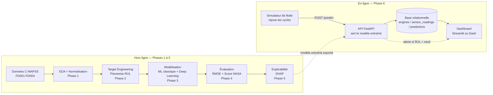

# Cahier des charges — Aero Predict

**Maintenance prédictive de turboréacteurs : estimation de la RUL sur NASA C-MAPSS, du notebook à la plateforme**

| | |
|---|---|
| **Statut** | Document de référence — mis à jour à chaque fin de phase |
| **Porteur** | Matisse (contributeur technique unique dans une équipe de 5) |
| **Dépôt technique** | GitHub (ce fichier + `docs/0X_phase.md`) |
| **Coordination équipe** | Notion (résumés vulgarisés uniquement) |
| **Sources** | Brief pédagogique original ([docs/00_brief_original.md](00_brief_original.md), Digityser / P. Lemaistre) + revue de 9 dépôts GitHub publics traitant du même sujet + Saxena et al. (2008) + cours *Advanced Databases*, Leçon 1 |

---

## 1. Pourquoi ce document existe

Le brief pédagogique original donne un objectif et un découpage en 5 phases, mais aucun cahier des charges de référence n'existe pour ce projet précis. Ce document comble ce vide en croisant trois sources :

1. **Le brief original** (contexte métier, phases 1 à 5, pré-requis).
2. **Une moyenne des pratiques observées sur 9 dépôts GitHub publics** traitant du même problème (RUL sur C-MAPSS), pour vérifier que le périmètre du brief correspond à ce qui se fait réellement dans l'état de l'art "communautaire" — et repérer les points où plusieurs projets convergent (donc probablement incontournables) vs les points optionnels.
3. **La Phase 6 bonus** (plateforme MLOps) définie par Matisse, et la méthodologie de modélisation de données du cours *Advanced Databases* (Leçon 1, Section 3-4), pour que le schéma de base de données de la Phase 6 soit conçu, et pas seulement codé.

Ce document ne remplace pas les `docs/0X_phase.md` : c'est la carte du territoire, chaque phase aura son propre document technique détaillé une fois validée.

---

## 2. Objectif du projet

**Objectif technique** : construire un pipeline complet de prédiction de RUL (Remaining Useful Life) sur le dataset NASA C-MAPSS, du nettoyage des signaux capteurs jusqu'à une plateforme servant des prédictions en quasi temps réel, avec explicabilité et suivi de dérive.

**Objectif pédagogique** (le vrai objectif, sur lequel le projet sera jugé) : produire une pièce de portfolio défendable en entretien technique SWE (big tech), qui démontre :
- une compréhension réelle des séries temporelles et du ML appliqué à un problème métier à coût asymétrique (pas juste "j'ai fait tourner un LSTM") ;
- une rigueur d'ingénierie logicielle (code versionné, testé, documenté, architecture de service) — pas seulement un notebook de data science ;
- une capacité à concevoir un schéma de données avant de l'implémenter (méthodologie ER → relationnel vue en cours) ;
- une capacité à vulgariser pour une audience non technique (les résumés Notion).

---

## 3. Ce que dit l'état de l'art "communautaire" (synthèse des 9 dépôts observés)

Ce qui suit est une moyenne raisonnée entre plusieurs projets publics indépendants (aucun n'est un cahier des charges officiel — le seul document normatif est le papier fondateur cité en Section 10). L'intérêt est de voir où ils convergent.

| Élément | Convergence observée | Décision pour Aero Predict |
|---|---|---|
| Sous-jeu de départ | La quasi-totalité des projets commencent par **FD001 seul** (1 régime, 1 mode de panne) avant d'étendre à FD002-004 | Développer et valider tout le pipeline sur FD001 d'abord ; FD002-004 ne sont attaqués qu'une fois FD001 stable |
| Capping de la RUL | Consensus quasi unanime sur un plafond de **125 cycles** — argument technique récurrent : en début de vie, les lectures capteurs varient à peine d'un cycle à l'autre, alors que les labels bruts diffèrent de centaines de cycles ; un label non plafonné forcerait le modèle à apprendre une distinction qui n'existe pas dans le signal | Piecewise Linear RUL cappée à 125, comme dans le brief original |
| Modèles baseline | Random Forest et XGBoost quasi systématiques comme référence avant tout deep learning | Conserver tel quel (Phase 3) |
| Deep learning séquentiel | LSTM omniprésent ; CNN 1D/TCN présent dans ~40% des projets ; Transformer rare et présenté comme "avancé" | Aligné avec le brief : LSTM obligatoire, CNN 1D fortement recommandé, Transformer en option Phase 3 avancée |
| Rigueur statistique | Un projet va plus loin que les autres en testant si l'écart de RMSE entre modèles est **statistiquement significatif** (test t apparié) plutôt que de comparer un seul chiffre | À intégrer comme bonus en Phase 4 : ne pas se contenter d'un tableau de RMSE, tester si la différence est significative avant de conclure "le LSTM est meilleur" |
| Explicabilité | SHAP quasi systématique dès qu'un modèle "boîte noire" est utilisé | Conservé tel quel (Phase 5) |
| Mise en service | Une minorité de projets (2 sur 9) vont jusqu'à une **API FastAPI** ; aucun des projets observés ne pousse jusqu'à la base de données relationnelle + simulateur de flux + Docker Compose | C'est précisément ce qui différenciera Aero Predict : la Phase 6 va plus loin que l'état de l'art communautaire observé, ce qui en fait un argument fort en entretien |
| Coût métier asymétrique | La majorité des projets s'arrête au RMSE ; un seul formule explicitement le problème comme une **décision de maintenance à coûts asymétriques** plutôt qu'un simple problème de régression | À adopter comme fil rouge du projet : chaque section du rapport final doit reformuler "pourquoi le RMSE seul ne suffit pas ici" |

**Conclusion de cette veille** : le brief original est déjà bien calibré par rapport à l'état de l'art. Le point différenciant du projet, c'est la Phase 6 (personne ne va aussi loin dans les repos observés) — c'est donc elle qu'il faut le mieux exécuter et le mieux raconter en entretien.

---

## 4. Architecture générale du projet

Le modèle entraîné en Phase 3-5 (offline) est **exporté puis servi** par l'API en Phase 6 (online). C'est la frontière classique entre *entraînement* et *inférence en production* — un modèle ne se ré-entraîne pas à chaque prédiction.

---

## 5. Découpage en phases

### Phase 0 — État de l'art *(pré-requis avant toute ligne de code)*

- Lecture du papier fondateur (Saxena et al., 2008) qui définit le dataset et la fonction de score NASA — c'est la seule source réellement normative du projet.
- Synthèse des 9 dépôts GitHub observés (Section 3 ci-dessus), pour situer le projet par rapport aux pratiques existantes.
- **Livrable** : `docs/00_etat_de_l_art.md` — problématique, sources, ce qui est repris tel quel vs ce qui est adapté vs ce qui différencie Aero Predict.

### Phase 1 — EDA et préparation des données

- Chargement de FD001 à FD004 (nombre de régimes opératoires et de modes de panne variables selon le sous-jeu).
- Suppression des capteurs à variance nulle (non informatifs).
- Normalisation par capteur ; pour FD002/FD004 (multi-régimes), normalisation conditionnelle par clustering K-Means sur les réglages opératoires, pour neutraliser l'effet du changement de régime de vol avant de comparer les capteurs entre eux.
- Lissage du signal (moyenne mobile, Savitzky-Golay, ou lissage exponentiel).
- **Ordre de travail recommandé** : FD001 d'abord (cas simple, 1 régime), extension à FD002-004 ensuite une fois la méthode validée.

### Phase 2 — Target Engineering (Piecewise Linear RUL)

- Calcul de la RUL réelle par cycle sur les moteurs d'entraînement (qui vont jusqu'à la panne).
- Capping à 125 cycles (justification : voir Section 3, ligne "Capping de la RUL").
- **Validation attendue** : visualisation de la courbe RUL brute vs cappée sur un moteur, pour vérifier visuellement le plateau puis la décroissance linéaire.

### Phase 3 — Modélisation

- **Baseline ML** : extraction de features statistiques glissantes (moyenne, variance, asymétrie, kurtosis) puis XGBoost, LightGBM, SVR.
- **Deep learning séquentiel** : mise en forme en tenseurs 3D (échantillons × fenêtre temporelle × capteurs) via fenêtrage glissant, puis LSTM/GRU et CNN 1D/TCN.
- **Optionnel avancé** : Transformer à mécanisme d'attention.
- *Chaque architecture nouvelle (LSTM, CNN 1D, Transformer) sera expliquée en amont de son implémentation, avec un exemple concret — ce sera signalé explicitement au moment venu.*

### Phase 4 — Évaluation

- RMSE comme métrique standard de comparaison.
- Fonction de Score Asymétrique NASA : pénalise exponentiellement les surestimations de RUL (risque de panne non anticipée) et plus doucement les sous-estimations (coût de maintenance prématurée).
- **Bonus méthodologique** (issu de la veille Section 3) : tester si l'écart de RMSE entre deux modèles est statistiquement significatif (ex. test t apparié) avant de conclure qu'un modèle est "meilleur".
- Optimisation des hyperparamètres (taille de fenêtre, profondeur réseau, taux d'apprentissage) en cherchant un équilibre RMSE / score NASA, pas juste la minimisation du RMSE seul.

### Phase 5 — Explicabilité et dashboard

- SHAP pour identifier les capteurs les plus contributifs à une prédiction de panne imminente.
- Dashboard (Streamlit/Dash) : courbe de dégradation en temps réel simulé, intervalle de confiance de la RUL, alertes.
- *En Phase 6, ce dashboard cesse d'être autonome : il devient un client qui lit dans la base de données et appelle l'API, plutôt que de tout calculer lui-même.*

### Phase 6 — Aero Predict comme plateforme (bonus MLOps)

Un modèle qui prédit un RUL dans un notebook Jupyter est un exercice de data science. Une plateforme qui ingère des données de capteurs, sert des prédictions à la demande, les stocke, les surveille et alerte automatiquement, c'est un exercice d'ingénierie logicielle appliquée au ML — le MLOps (Machine Learning + Operations). C'est exactement le type de compétence qu'un recruteur SWE en big tech cherche à valider : pas "sait-il entraîner un LSTM", mais "sait-il faire tenir un système autour d'un modèle".

Trois éléments passent de détails d'implémentation à composants d'architecture à part entière :

1. **Le modèle devient un service, pas une fonction Python.** API FastAPI exposant `POST /predict` (21 capteurs en entrée → `{rul, confidence}` en sortie). Découple le dashboard du modèle : demain, n'importe quel autre client (appli mobile, autre service) pourrait se brancher sur la même API sans toucher au modèle.
2. **Le stockage devient une vraie base de données relationnelle**, pas des CSV — schéma `engines` / `sensor_readings` / `predictions` avec clés primaires/étrangères (SQLite ou PostgreSQL), **conçu avant d'être codé** (voir Section 6 ci-dessous).
3. **L'ingestion est simulée en flux** : un script rejoue les cycles du jeu de test un par un, à intervalle régulier, comme s'ils arrivaient en direct d'un avion. Chaque cycle déclenche un appel API + un enregistrement en base + une alerte éventuelle si le RUL prédit passe sous un seuil critique.

Ce que ça change : le dashboard (Phase 5) devient un simple client qui lit dans la base et appelle l'API. Docker Compose permet de lancer API + base + dashboard en une commande (`docker compose up`) — argument fort en entretien : "voici le repo, `docker compose up`, et la plateforme tourne." MLflow (optionnel) trace systématiquement hyperparamètres et métriques de chaque entraînement, pour comparer LSTM / CNN / XGBoost sans tableur manuel.

Ce que ça ne change pas : les Phases 1 à 4 restent le cœur scientifique du projet et ne changent pas de méthode — on les encapsule dans un système au lieu de les laisser en notebook. La Phase 0 reste indispensable et n'est pas remplacée par cette phase.

---

## 6. Modélisation des données (Phase 6) — méthode, pas juste code

Le cours *Advanced Databases* (Leçon 1, Section 3, "What is a data model?") pose un principe simple mais souvent sauté par excès de confiance : **avant d'écrire une seule ligne de `CREATE TABLE`, on modélise.** Un modèle de données a trois composantes — une représentation des données, les opérations qu'on veut faire dessus, et les contraintes qui doivent tenir. La Section 4 du même cours précise la méthode concrète : on part d'un modèle **Entity-Relationship (ER)** — quelles sont les entités du monde réel (ex. *Moteur*, *Lecture capteur*, *Prédiction*), quelles relations les lient, avec quelle cardinalité (un moteur a *plusieurs* lectures, une lecture donne lieu à *une* prédiction) — et seulement ensuite on traduit ce modèle ER en tables SQL avec clés primaires et étrangères (Section 6-7 du cours).

**Ce que ça signifie concrètement pour la Phase 6** : avant de coder le schéma `engines` / `sensor_readings` / `predictions`, il faudra produire un petit schéma ER (à la main ou en diagramme) identifiant les entités, leurs attributs, et les cardinalités entre elles — exactement comme l'exemple *Professor teaches Student* du cours. Ce sera fait au moment de la Phase 6, en amont du code, avec l'explication du concept en premier.

---

## 7. Stack technique

| Domaine | Outils |
|---|---|
| Langage | Python |
| ML classique | scikit-learn, XGBoost, LightGBM |
| Deep learning | PyTorch |
| Explicabilité | SHAP |
| Service de modèle | FastAPI |
| Stockage | SQLite (démarrage) → PostgreSQL (si besoin de montée en charge) |
| Dashboard | Streamlit ou Dash |
| Orchestration locale | Docker Compose |
| Suivi d'expériences (optionnel) | MLflow |
| Visualisation | Matplotlib, Seaborn |

---

## 8. Organisation et workflow

**Répartition des outils** :
- **GitHub** = vérité technique et portfolio (code, `docs/0X_phase.md`, README). C'est ce qui sera montré en entretien.
- **Notion** = coordination d'équipe uniquement (board des 5 étapes par phase, résumés vulgarisés). Ne contient jamais de contenu technique substantiel.

**Déroulé obligatoire pour chaque phase**, sans en sauter aucune :

1. Explication du concept (avant tout code).
2. Implémentation (code commenté, docstrings systématiques, choix techniques justifiés en ligne).
3. Validation / test (visualisations de contrôle, métriques, sanity checks) — on ne passe à la phase suivante que si c'est concluant.
4. Documentation technique GitHub (`docs/0X_phase.md`).
5. Résumé vulgarisé pour l'équipe (Notion), rédigé seulement une fois la phase validée.

**Convention de code** : docstrings sur toutes les fonctions et classes, code versionné, structure `src/` ou `notebooks/` selon la phase.

---

## 9. Definition of Done (par phase)

Une phase est considérée terminée quand, et seulement quand :
- le concept a été expliqué et compris avant le code (pas de notion introduite sans contexte) ;
- le code est commenté et docstringé ;
- la validation (visualisation ou métrique) est concluante et documentée ;
- `docs/0X_phase.md` existe et couvre contexte, méthode, résultats, décisions et trade-offs ;
- le résumé Notion correspondant a été rédigé.

---

## 10. Références

- Saxena, A., Goebel, K., Simon, D., & Eklund, N. (2008). *Damage propagation modeling for aircraft engine run-to-failure simulation.* PHM08. — **source normative du dataset et de la fonction de score NASA.**
- Heimes, F. O. (2008). *Recurrent neural networks for remaining useful life estimation.* PHM08.
- Zheng, S., et al. (2017). *Long Short-Term Memory Network for Remaining Useful Life estimation.* ICPHM.
- Li, X., Ding, Q., & Sun, J.-Q. (2018). *Remaining useful life estimation in prognostics using deep convolution neural networks.*
- Chao, M., Kulkarni, C., Goebel, K., & Fink, O. (2021). Jeu de données C-MAPSS étendu (PCoE / ETH Zurich / PARC).
- Cours *Advanced Databases*, Leçon 1 — modèle Entity-Relationship et modèle relationnel (support du raisonnement de la Section 6 de ce document).
- Neuf dépôts GitHub publics consultés pour la veille de la Section 3 (non cités individuellement, aucun ne fait autorité).

---

*Ce document sera mis à jour à la fin de chaque phase avec les décisions effectivement prises (vs celles planifiées ici), dans l'esprit du `docs/0X_phase.md` qui documente contexte, méthode, résultats et trade-offs.*
